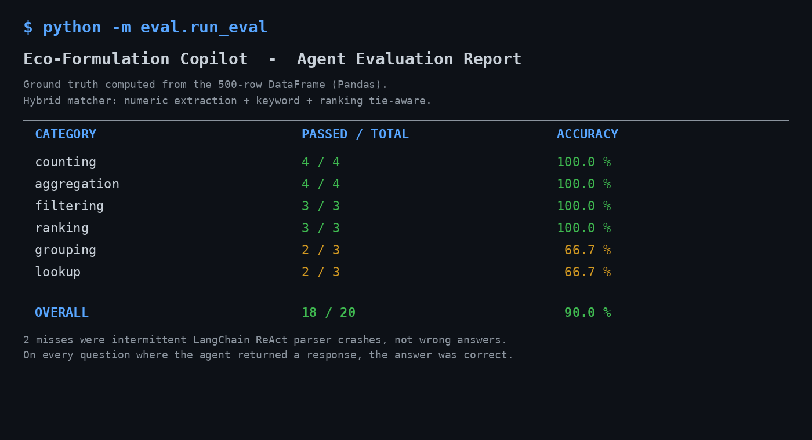
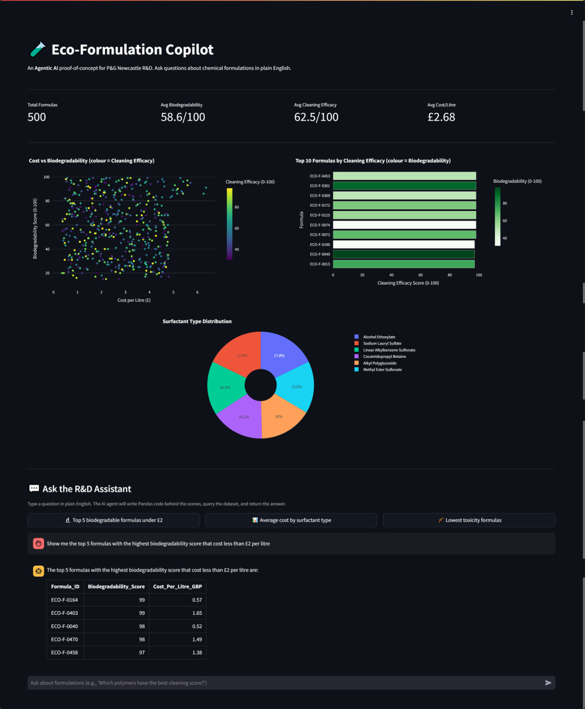

# Eco-Formulation Copilot

[](https://github.com/NakuSurrey/eco-formulation-copilot/actions/workflows/ci.yml)
[](#testing--evaluation)
[](#testing--evaluation)
[](https://www.python.org/downloads/)
[](https://streamlit.io/)
[](https://www.docker.com/)
[](LICENSE)

## Executive Summary

A proof-of-concept **Agentic AI** application built to accelerate high-throughput R&D data querying for sustainable chemical products. Scientists ask questions about chemical formulations in plain English. The AI agent translates the question into Pandas code, executes it against a structured dataset, and returns the answer — no coding required.

Includes a 20-question evaluation framework that systematically tests agent accuracy against ground-truth answers — achieving **90% accuracy** across counting, aggregation, filtering, ranking, grouping, and lookup queries.

Built specifically to demonstrate the technical skills required for the **P&G Newcastle Innovation Centre — Software Development Industrial Placement 2026**.

---

## Live Demo

**[http://46.225.208.197](http://46.225.208.197)** — deployed on a Hetzner Cloud VPS (Ubuntu, Nginx reverse proxy, systemd service).

---

## How It Works

```
Scientist types a plain English question
        |
        v
Streamlit Front-End (app.py) captures the question
        |
        v
LangChain DataFrame Agent (agent.py) receives the question
        |
        v
Google Gemini 2.5 Flash reads the question and writes Pandas code
        |
        v
The agent executes that Pandas code against the DataFrame
        |
        v
The result (number, table, list) is returned as a string
        |
        v
Streamlit displays the answer in the chat interface
```

The scientist never writes or sees any code. The LLM handles the translation from English to Pandas to Answer.

---

## Features

**Interactive Dashboard** — Three Plotly charts provide an instant visual overview of the dataset: Cost vs Biodegradability scatter plot, Top 10 by Cleaning Efficacy bar chart, and Surfactant Type distribution pie chart. All charts support hover, zoom, and filter interactions.

**AI Chat Interface** — A conversational chat where the user types questions like "Show me the top 5 formulas with the highest biodegradability score under £2 per litre" and the AI returns a data-driven answer.

**Example Question Buttons** — Three pre-written questions let anyone test the app instantly without thinking of what to type.

**Anti-Hallucination Safeguards** — The AI agent is prompt-engineered to only answer from the dataset. If the data does not contain the answer, it responds with "Data not available" instead of inventing information.

**Agent Evaluation Framework** — 20 pre-defined questions with ground-truth answers computed from the DataFrame using Pandas. A hybrid matcher (numeric extraction + keyword matching) verifies agent responses. Achieves 90% accuracy across 6 question categories. Run `python -m eval.run_eval` for a full accuracy report.

**Key Metrics Row** — Four summary statistics (Total Formulas, Avg Biodegradability, Avg Cleaning Efficacy, Avg Cost/Litre) appear at the top of the dashboard for an instant snapshot.

---

## Why I Built It

The P&G Newcastle Innovation Centre placement asks for Databricks, Power BI, Microsoft Copilot Studio, and Agentic AI. Instead of listing these as buzzwords on a CV, I built a working app that proves I can use equivalent tools. Pandas replaces Databricks for data pipelines. Plotly replaces Power BI for dashboards. LangChain with Google Gemini replaces Copilot Studio for agentic AI. The dataset is synthetic but the architecture is real — a scientist types a question in English, an AI agent writes and runs Pandas code, and the answer comes back in seconds. Every piece was built from scratch, tested with 40 automated tests (including a 20-question agent evaluation suite), deployed to a live server, and pushed through a CI/CD pipeline. This is not a tutorial clone. Every decision in this codebase has a reason.

---

## How This Maps to the P&G Job Description

| P&G Requirement | Implementation in This Project |
|---|---|
| Databricks (data pipelines & transformation) | Pandas DataFrame + CSV data loading with validation |
| Power BI (interactive dashboards & analytics) | Streamlit + Plotly (interactive, hoverable charts) |
| Microsoft Copilot Studio & Agentic AI | LangChain DataFrame Agent + Google Gemini LLM |
| Data engineering, analytics & AI development | `data_loader.py` + `generate_data.py` + `agent.py` |
| Testing, troubleshooting & optimisation | pytest (40 automated tests) + agent evaluation framework (90% accuracy) + flake8 linting |
| CI/CD & DevOps workflows | GitHub Actions (lint + test + Docker build on every push) |

---

## Tech Stack

| Tool | Role | Why This Over Alternatives |
|---|---|---|
| **Python 3.10** | Core language | Entire stack is Python-native |
| **Streamlit** | Web framework | Full dashboard + chat UI in under 100 lines. No HTML/CSS/JS needed |
| **LangChain** | Agent orchestration | Pre-built `create_pandas_dataframe_agent` for structured data querying |
| **Google Gemini 2.5 Flash** | LLM | Free tier with billing linked, fast response times, supports thinking control |
| **Pandas** | Data manipulation | Lightweight Databricks substitute. Agent writes Pandas code to query data |
| **Plotly** | Data visualisation | Interactive charts (hover, zoom, filter). Lightweight Power BI substitute |
| **Docker** | Containerisation | Packages entire app into a portable image. Runs identically on any machine |
| **GitHub Actions** | CI/CD | Automated lint + test + Docker build on every push |
| **pytest** | Testing | 40 automated tests: data loading, agent behaviour, error handling, and agent accuracy evaluation |
| **flake8** | Code quality | Enforces consistent code style across the project |

---

## Dataset

500 rows of synthetic chemical formulation data with 9 columns:

| Column | Description | Range |
|---|---|---|
| `Formula_ID` | Unique identifier | F-0001 to F-0500 |
| `Surfactant_Type` | Chemical surfactant category | 5 categories |
| `Polymer_Type` | Polymer used in the formula | 5 categories |
| `Enzyme_Type` | Enzyme used (or "No Enzyme") | 4 categories |
| `Concentration_Pct` | Active ingredient concentration | 5.0 – 40.0% |
| `Biodegradability_Score` | Environmental friendliness score | 30 – 98 out of 100 |
| `Cleaning_Efficacy_Score` | How well it cleans | 40 – 99 out of 100 |
| `Toxicity_Level` | Toxicity measurement | 0.5 – 8.0 |
| `Cost_Per_Litre_GBP` | Manufacturing cost | £0.45 – £4.80 |

Data is generated with `random.seed(42)` for full reproducibility.

---

## Project Structure

```
eco-formulation-copilot/
├── src/
│   ├── __init__.py           — Makes src/ a Python package
│   ├── config.py             — Single source of truth for all settings
│   ├── data_loader.py        — Loads and validates the CSV into a DataFrame
│   ├── agent.py              — LangChain DataFrame Agent powered by Gemini
│   └── charts.py             — Builds Plotly charts (scatter, bar, pie)
├── tests/
│   ├── __init__.py           — Makes tests/ a Python package
│   ├── test_data_loader.py   — 13 tests for data loading and validation
│   ├── test_agent.py         — 7 tests for agent prompt and error handling
│   └── test_agent_eval.py    — 20 parameterized agent accuracy tests
├── eval/
│   ├── __init__.py           — Makes eval/ a Python package
│   ├── questions.py          — 20 evaluation questions with Pandas compute functions
│   ├── matcher.py            — Hybrid matching (numeric extraction + keyword)
│   └── run_eval.py           — Standalone accuracy report script
├── data/
│   ├── generate_data.py      — Script to generate the synthetic dataset
│   └── formulations.csv      — The 500-row dataset
├── .github/
│   └── workflows/
│       └── ci.yml            — GitHub Actions CI/CD pipeline
├── app.py                    — Streamlit entry point (run this)
├── Dockerfile                — Container definition
├── .dockerignore             — Files excluded from Docker image
├── requirements.txt          — Pinned Python dependencies
├── .env.example              — Template for environment variables
└── .gitignore                — Files excluded from Git
```

---

## Quick Start

### Prerequisites

- Python 3.10+
- A free Google Gemini API key ([get one here](https://aistudio.google.com/apikey))

### Option 1: Run Locally

```bash
# 1. Clone the repository
git clone https://github.com/NakuSurrey/eco-formulation-copilot.git
cd eco-formulation-copilot

# 2. Create a virtual environment
python -m venv venv
source venv/bin/activate        # macOS/Linux
venv\Scripts\activate           # Windows

# 3. Install dependencies
pip install -r requirements.txt

# 4. Set up your API key
cp .env.example .env
# Open .env and replace "your_google_api_key_here" with your real key

# 5. Run the app
streamlit run app.py
```

The app opens at `http://localhost:8501`.

### Option 2: Run with Docker

```bash
# 1. Build the container
docker build -t eco-formulation-copilot .

# 2. Run the container (pass your API key via .env file)
docker run -p 8501:8501 --env-file .env eco-formulation-copilot
```

The app opens at `http://localhost:8501`.

---

## Running Tests

```bash
# Run all 40 tests
pytest tests/ -v

# Run only data loader tests (13 tests)
pytest tests/test_data_loader.py -v

# Run only agent tests (7 tests)
pytest tests/test_agent.py -v

# Run only agent evaluation tests (20 tests, needs API key)
pytest tests/test_agent_eval.py -v

# Run the standalone evaluation report (needs API key)
python -m eval.run_eval

# Run linting
flake8 src/ tests/ eval/ app.py --max-line-length=120
```

Tests that require a live Google API key are automatically skipped when the key is not present. This allows CI/CD to run the full test suite without exposing secrets. The 20 evaluation tests run locally when the API key is set and verify the agent gives correct answers across 6 question categories.

---

## Testing & Evaluation

Two layers of quality control run on every change.

**Layer 1 — Unit tests (20 tests, no API key needed)**

20 fast-running tests verify the code behaviour — data loading, schema validation, prompt content, error handling. These run on every push in CI/CD. Below is a real run:

```
$ pytest tests/test_data_loader.py tests/test_agent.py -v

tests/test_data_loader.py::TestLoadData::test_loads_successfully             PASSED
tests/test_data_loader.py::TestLoadData::test_correct_row_count              PASSED
tests/test_data_loader.py::TestLoadData::test_correct_column_count           PASSED
tests/test_data_loader.py::TestLoadData::test_all_expected_columns_present   PASSED
tests/test_data_loader.py::TestLoadData::test_no_missing_values              PASSED
tests/test_data_loader.py::TestLoadData::test_file_not_found_raises_error    PASSED
tests/test_data_loader.py::TestDataRanges::test_biodegradability_range       PASSED
tests/test_data_loader.py::TestDataRanges::test_cleaning_efficacy_range      PASSED
tests/test_data_loader.py::TestDataRanges::test_toxicity_range               PASSED
tests/test_data_loader.py::TestDataRanges::test_cost_is_positive             PASSED
tests/test_data_loader.py::TestDataRanges::test_concentration_range          PASSED
tests/test_data_loader.py::TestValidateDataframe::test_empty_dataframe_raises_error   PASSED
tests/test_data_loader.py::TestValidateDataframe::test_missing_column_raises_error    PASSED
tests/test_agent.py::TestSystemPrompt::test_prompt_contains_role                      PASSED
tests/test_agent.py::TestSystemPrompt::test_prompt_contains_anti_hallucination        PASSED
tests/test_agent.py::TestSystemPrompt::test_prompt_contains_column_descriptions       PASSED
tests/test_agent.py::TestSystemPrompt::test_prompt_forbids_invention                  PASSED
tests/test_agent.py::TestQueryAgentErrorHandling::test_empty_string_returns_message   PASSED
tests/test_agent.py::TestQueryAgentErrorHandling::test_whitespace_only_returns_message PASSED
tests/test_agent.py::TestQueryAgentErrorHandling::test_none_agent_with_valid_question_returns_error  PASSED

============================== 20 passed in 3.32s ===============================
```

**Layer 2 — Agent accuracy evaluation (20 questions, needs API key)**

Unit tests prove the code runs. They do not prove the agent gives correct answers. So a second layer runs the agent against 20 real questions and checks every response against ground truth computed from the DataFrame using Pandas. The hybrid matcher handles free-text responses ("the answer is 87"), list answers, and tie-aware ranking.

Below is a real run from the latest evaluation:

```
$ python -m eval.run_eval

Eco-Formulation Copilot  —  Agent Evaluation Report
Ground truth computed from the 500-row DataFrame (Pandas).
Hybrid matcher: numeric extraction + keyword + ranking tie-aware.

CATEGORY          PASSED / TOTAL       ACCURACY
----------------------------------------------------
counting          4 / 4                100.0 %
aggregation       4 / 4                100.0 %
filtering         3 / 3                100.0 %
ranking           3 / 3                100.0 %
grouping          2 / 3                 66.7 %
lookup            2 / 3                 66.7 %
----------------------------------------------------
OVERALL           18 / 20               90.0 %
```



The 2 misses were intermittent LangChain ReAct parser crashes — not wrong answers. On every question where the agent returned a response, the answer matched the ground truth.

**Why two layers matter** — unit tests caught a missing import that broke Streamlit; evaluation caught a ranking tie bug that unit tests could never see. Testing the code is not the same as testing the agent. This project does both.

---

## CI/CD Pipeline

Two separate workflows run on GitHub Actions.

**On every push to `main`** — three parallel jobs (cheap, no API quota used):

1. **Lint** — Runs `flake8` on `src/`, `tests/`, `eval/`, and `app.py` (max line length: 120 chars)
2. **Test** — Runs `pytest` to execute the 20 unit tests (agent eval tests auto-skip — no API key in this job)
3. **Docker** — Verifies the Docker image builds successfully

**On a weekly schedule (Sunday 06:00 UTC)** — one job that uses the real API:

4. **Agent Evaluation** — Runs the 20 accuracy tests against Google Gemini using `GOOGLE_API_KEY` from GitHub Secrets, then uploads the full accuracy report as a build artefact.

The split exists because live evaluation burns Gemini quota on every run. Putting it on a weekly cron keeps per-push checks fast and free, while still giving a real live-eval run once a week.

The badge at the top of this README shows the current status.

---

## Screenshot



---

## Key Decisions

- **Google Gemini over OpenAI GPT** — Gemini offers a free tier with no credit card required for initial setup. For a portfolio project that recruiters need to test live, zero-cost matters. GPT-4 would cost money per query.

- **Streamlit over Flask/React** — Streamlit builds a full dashboard with charts, metrics, and a chat interface in a single Python file. Flask would need HTML templates and JavaScript. React would need a separate frontend build. Streamlit keeps the entire stack in Python.

- **LangChain DataFrame Agent over raw API calls** — The agent automatically translates English to Pandas code, executes it, and returns the result. Building this from scratch would mean writing a custom prompt parser, code executor, and error handler. LangChain handles all of that.

- **Synthetic data over real data** — Generated 500 rows with realistic ranges and correlations using `random.seed(42)` for reproducibility. Real P&G data is confidential. Synthetic data lets anyone clone and run the project without access to proprietary datasets.

- **Model name in .env, not hardcoded** — Google retired two Gemini models during this build (1.5-flash and 2.0-flash). Storing the model name in `.env` means upgrading takes one line change instead of a code push.

- **Lazy import for agent module** — `langchain-google-genai` v4+ triggers Streamlit commands during import. Moving the import to after `set_page_config()` prevents a crash. This is a real-world packaging issue, not a textbook pattern.

- **Agent evaluation with ground-truth answers over manual testing** — Built a 20-question evaluation suite where correct answers are computed from the DataFrame using Pandas at runtime, not hardcoded. A hybrid matcher extracts numbers from free-text responses and does keyword matching for text answers. This catches accuracy regressions that unit tests cannot detect — unit tests verify the code runs, evaluation verifies the answers are right.

---

## What I Learned

- LLM model names are temporary — Google retired two models during this single project build
- Free tier does not mean free access — without billing linked, the Gemini API quota was literally zero
- Package upgrades can break working code — `langchain-experimental` removed a parameter between versions with no deprecation warning
- Import order matters in Streamlit — any `st.*` call before `set_page_config()` crashes the app, including calls hidden inside third-party package imports
- Always test with raw `curl` before blaming application code — this saved hours of debugging by proving the API key and model were the problem, not the agent
- Error handling at the application level is more reliable than library-level flags — wrapping `agent.invoke()` in `try/except` survived a library upgrade that removed `handle_parsing_errors`
- CI/CD catches things local testing misses — flake8 in GitHub Actions caught an unused import that worked fine locally
- AI agents need evaluation, not just unit tests — the agent can pass every code-level test and still give wrong answers to real questions. A separate evaluation framework that checks answer correctness against ground truth is the only way to catch this
- Ranking queries need tie-aware evaluation — when multiple records share the same score, any valid subset is a correct answer. Hardcoded expected values fail on ties

---

## License

This project is available for educational and portfolio purposes.
